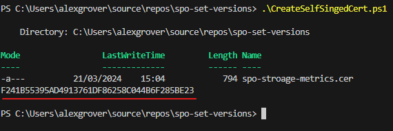
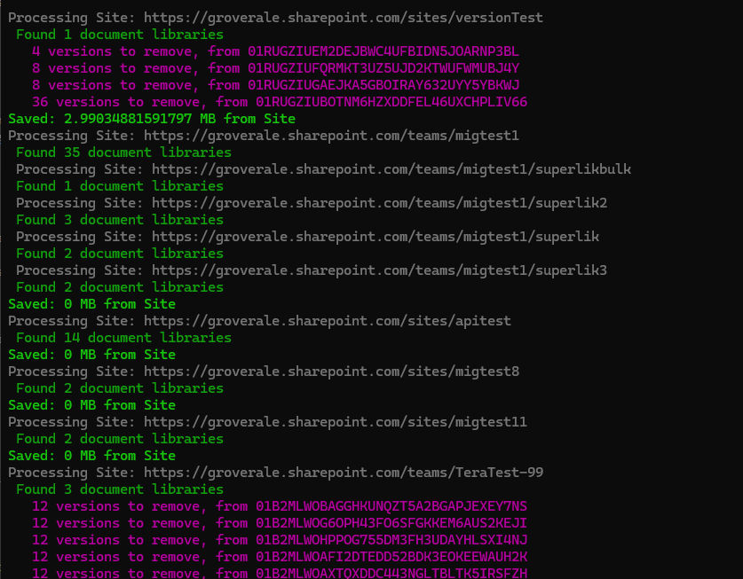

# spo-set-versions
PowerShell script to set Major and Minor versions across SharePoint sites and remove out-of-date versions. This will script will help you to regain some storage.

The script is ready to go but requires a couple of components / input and config files

* App Registration
* Sites.csv input file
* parametersVersions.json config file

## App Registration

The app registration is the identity that the scrip uses access the SPO data.

The following application permissions are required:

    MSGraph 	Files.ReadWrite.All
	SharePoint 	Sites.FullControl.All

These permission provide the script the ability to read and delete file versions in every Library in every site. This also provide the scrip the ability to update teh version configuration libraries. A combination of MSGraph and SharePoint permissions are required as the solution utilises both of the APIs.

### Certificate

A certificate is used by the script to obtain a context / connection using the app registration. The certificates public key (.cer) must be uploaded to the App registration.

The certificate private key (.pfx) is stored on the device that runs the script.

An additional script has been included in the repo to create a self-signed certificate. Example execution as follows:



This will script will create the .cer files (upload to the app registration) and output the thumbprint. This thumbprint should be added to the `parametersVersions.json` file.

## Sites CSV

This file is both the input and output of the script. The script will only target sites that are included in this file.

The following example input file has 8 sites, 1 of those sites has specific settings. The other 7 do not and would inherit the settings defined in the `parametersVersions.json` file.

| "SiteUrl"                                                        | "SpecificVersionSetting" | "MajorVersionCount" | "MinorVersionCount" | "SizeSavedMB"        |
|------------------------------------------------------------------|--------------------------|---------------------|---------------------|----------------------|
| "https://groverale.sharepoint.com/sites/versionTest"             | "TRUE"                   | "2"                 | "0"                 | "2.9903488159179688" |
| "https://groverale.sharepoint.com/teams/migtest1"                | "FALSE"                  | ""                  | ""                  | "0"                  |
| "https://groverale.sharepoint.com/sites/apitest"                 | "FALSE"                  | ""                  | ""                  | "0"                  |
| "https://groverale.sharepoint.com/sites/migtest8"                | "FALSE"                  | ""                  | ""                  | "0"                  |
| "https://groverale.sharepoint.com/sites/migtest11"               | "FALSE"                  | ""                  | ""                  | "0"                  |
| "https://groverale.sharepoint.com/teams/TeraTest-99"             | "FALSE"                  | ""                  | ""                  | "120.32295227050781" |
| "https://groverale.sharepoint.com/teams/proptest"                | "FALSE"                  | ""                  | ""                  | "0"                  |
| "https://groverale.sharepoint.com/teams/SP2010-Test-Data-CIOPMO" | "FALSE"                  | ""                  | ""                  | "0"                  |

Notice the `SizeSavedMB` column, this is populate in both `whatif` mode and `delete` mode. This is the only recorded output. 

The console outputs further details about file version counts to be removed for each file.



## parametersVersions.json

The script is controlled by a number of parameters. These parameters are stored in the `parametersVersions.json` and is read in by the script. Each parameter has a value and a description.

Example files below:

```json
{
    "tenantId": {
        "Value": "75e67881-b174-484b-9d30-c581c7ebc177",
        "Description": "Id of the tenant. Can be found in the Azure Active Directory blade."
    },
    "clientId": {
        "Value": "34f4c95f-0249-4568-a3b7-90eb4483a589",
        "Description": "Client Id of the SetLibraryVersion AAD application. Must have Sites.FullControl or Sites.Selected for sites to be processed. Both MSGraph and SharePoint APIs"
    },
    "thumbprint" : {
        "Value": "8B36268326AE2EA486BB97061F081B7562513FE3",
        "Description": "Thumbprint of the certificate from the device running Set Version script."
    },
    "inputCSV": {
        "Value": "./SitesToProcess.csv",
        "Description": "CSV file with list of sites to process"
    },
    "majorVersionCount": {
        "Value": "50",
        "Description": "Number of major versions to configure on the Libraries (0 will disable major versions)"
    },
    "minorVersionCount": {
        "Value": "0",
        "Description": "Number of minor versions to configure on the Libraries (0 will disable minor versions)"
    },
    "previousVersionExpireDate": {
        "Value": "2022-02-28T15:00:00Z",
        "Description": "Date to keep previous version from"
    },
    "useDateExpiration": {
        "Value": false,
        "Description": "By default version counts are used to remove - setting this to true will use dates instead of version counts"
    },
    "whatIfMode": {
        "Value": true,
        "Description": "If true, storage saving will be calculated but files won't be deleted."
    },
    "deleteOldMajorVersions": {
        "Value": true,
        "Description": "If true, item versions that are less than the count will be removed. So no storage saving immediately"
    },
    "configureLibraryVersionSettings": {
        "Value": false,
        "Description": "If false, libraries will not have their version settings configured"
    },
    "sendToRecycleBin": {
        "Value": false,
        "Description": "If true, items are deleted before library version config is set so items go into recycle bin and can be restored - this is slower"
    }
}
```

## Considerations

There are number of items to consider before running this script.

### Retention

If you have any retention polices applied to sites in the input file, the versions will be retained in the preservation hold library and there will be no storage uplift.

Whilst temporarily disabling the retention policy will help, as it would enabled the versions to be deleted. This could have the adverse affect of files being retained being removed from the PH Library by the SharePoint timer service. The timer service checks the PH Library every 7 days for files that have reached their retention schedule. As there will be no policy, there will be no retention schedule so all files in the PH Library will be moved into the recycle bin.

It is recommended to perform some analysis on the PH libraries of sites that have their retention policy disabled. This way you would be able to capture any files that are unintentionally removed from the PH library my the timer service.

### Throttling / Rate Limits

In production tenant it's likely that we will be dealing with millions, if not tens of millions of files. This means millions are graph calls. The following table shows the app limits enforced on the endpoints that the script uses.

When selecting sites for a run, it would be recommend to not included sites with more files than the daily limit. This will help avoid any script failures

| License count | 0 – 1k    | 1k – 5k   | 5k - 15k  | 15k - 50k | 50k+      |
| ------------- | --------- | --------- | --------- | --------- | --------- |
| App 1 minute  | 1,200     | 2,400     | 3,600     | 4,800     | 6,000     |
| App daily     | 1,200,000 | 2,400,000 | 3,600,000 | 4,800,000 | 6,000,000 |

## Next Steps

This script works as is, but there are a few outstanding actions items to improve this scripts functionality and quality of life.

* Batch the Graph requests, this should help reduce the likelihood of throttling
* Progress indicator, to indicate that the script is processing data
* Ability to not make library version changes, just delete versions. This will be preferable configuration when working with active sites / libraries


# Disclaimer
THIS CODE IS PROVIDED AS IS WITHOUT WARRANTY OF ANY KIND, EITHER EXPRESS OR IMPLIED, INCLUDING ANY IMPLIED WARRANTIES OF FITNESS FOR A PARTICULAR PURPOSE, MERCHANTABILITY, OR NON-INFRINGEMENT.
